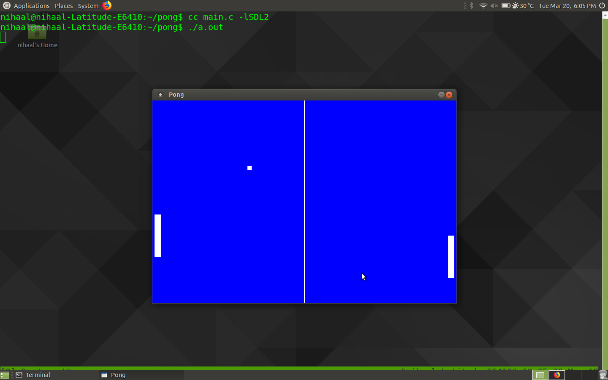

# Pong
A small game written in C using the SDL2 library. 
The game is quite simple and so the code can be used to learn the basics of SDL2.

Play using W,A,S,D and the arrow keys.
Have fun

### Compiling instructions
* Install libsdl2 using the command 
```
sudo apt-get install libsdl2-dev
```
* Compile and run by typing the command 
``` 
gcc main.c -lSDL2 -o pong
./pong
```

### Screenshot

